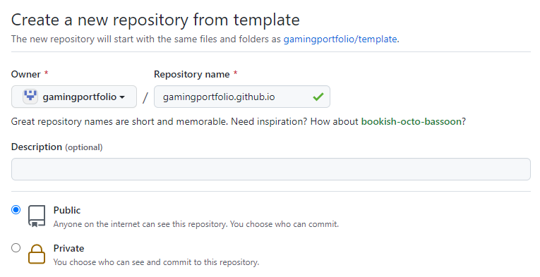
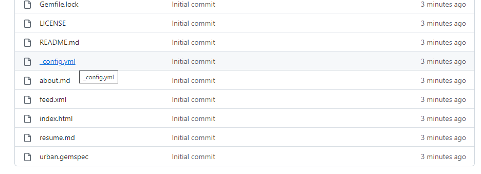

# Urban Theme (Portfolio) Quick Start

## Setting up on GitHub Pages

1. If you do not have a GitHub account yet, create one and login with it
2. From the [gamingportfolio/template](gamingportfolio/template) page on GitHub, select "Use this template" and click "Create a new repository":
   
3. From this page, keep the owner either as your GitHub username (or if you have an organization you want to use, select the organization). The repo name should be named `githubname.github.io`. For example, if I'm making it for the `gamingportfolio` organization, I would use `gamingportfolio.github.io`. Make sure this repo is ***public*** (otherwise, you will need a paid/pro account to host on GitHub pages).
   
4. After a few moments, it will create your copy of the template
5. Click on the `_config.yml` file listed in the root of the repository:
   
6. From this page, click on the "Edit this file" button on the right, above the file:
   
7. This file contains some basic configuration settings for your website. You should change the following:
   * `title:` - Put your name here
   * `email:` - Put the email address to contact you
   * `description:` - Use this to summarize your skills
   * `url:` - This should be `https://githubusername.github.io` where `githubusername` is the user/org you are making the site for
   * `linkedin_url:` - Put your public LinkedIn profile URL here
   * `github_username:` - (Optional). If you want to link to your GitHub page, you can do that with this item. Alternatively, you can delete this line if you don't want to link it
   * twitter_username: - )

## Acknowledgements

This is largely based on the original [urban-theme](https://github.com/midzer/urban-theme). See LICENSE for full licensing information.
